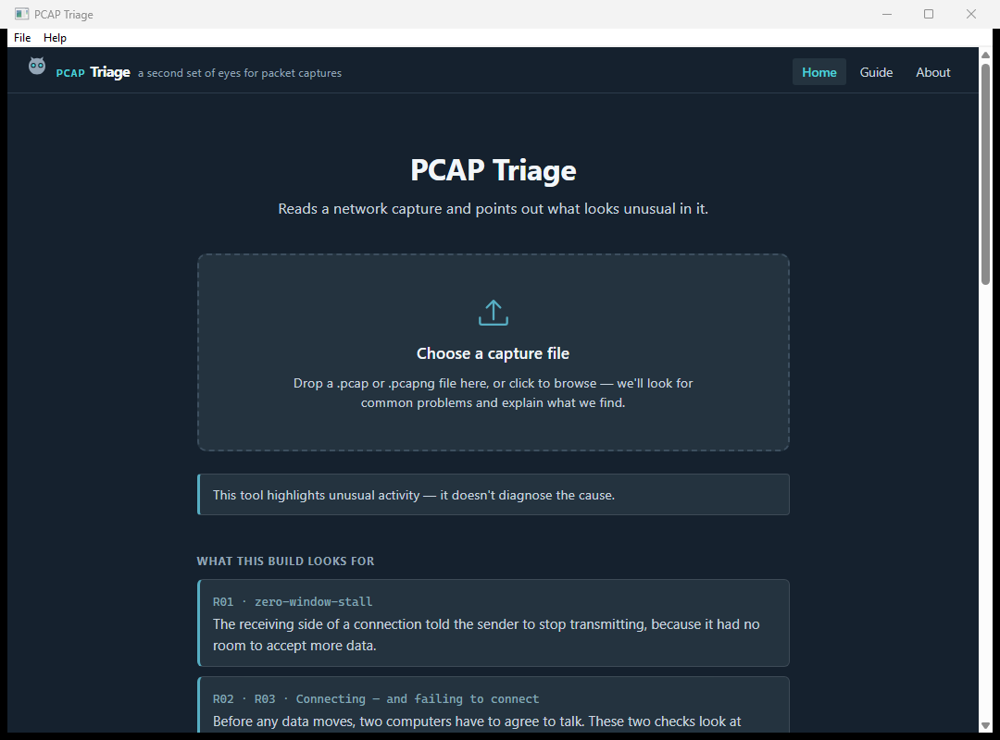

# PCAP Triage

A second set of eyes for packet captures. It reads a `.pcap` or `.pcapng` file
and points out what looks unusual in it, in plain English, ranked so the thing
most worth your attention is at the top.



## Who it's for

Someone who has a capture file and a problem, and who does not already know
what to look for in Wireshark — or would not know how to read the answer if
they found it.

It runs fifteen checks covering the conditions that account for most
"the network is slow" reports: stalled receivers, slow servers, packet loss and
how it was recovered, connections refused or unanswered, connections dying
mid-transfer, latency outliers, failing name lookups, failing TLS negotiations,
and paths that quietly drop large packets.

Every finding tells you **what was observed, why it stood out, which frames
show it, and what to check next.** You can take the frame numbers straight into
Wireshark.

## Download and install

Grab the latest `pcaptriage-gui.exe` from the
[releases page](https://github.com/Proxy-IT/pcaptriage/releases). There is no
installer — it is a single file. Put it wherever you like and run it.

**Windows will warn you the first time.** The binary is not code-signed, so
SmartScreen shows *"Windows protected your PC"* with an **unknown publisher**.
That is expected, not a sign anything is wrong: code-signing certificates cost
money annually and this is a free tool. To run it anyway, click **More info**
and then **Run anyway**.

If you would rather not trust a binary from a stranger, the source is here and
it builds in one command — see [Building from source](#building-from-source).

## What it does not do

**It does not tell you what broke.** It reports what is unusual and shows its
working; the diagnosis is yours. A finding says *"this server responded in 1.8s
at p95 while 41 others are under 40ms"* — never *"this server is the problem"*.
The first is checkable. The second is a guess wearing a lab coat.

**An empty result does not mean the capture is healthy.** It means these
fifteen checks found nothing. Plenty can be wrong with a network that none of
them look for, and the report says so every time rather than letting silence
read as an all-clear.

**It cannot read encrypted traffic**, and says so instead of skipping quietly.
Name lookups over DNS-over-TLS, and TLS 1.3 handshakes where the certificate is
encrypted, are reported as *not assessed* rather than as *fine*.

**Windows only, today.** It is built with Wails and should build for macOS and
Linux, but neither has been produced or tested. If you want one, say so.

**It is an alpha.** The thresholds that decide what counts as unusual are
starting points, calibrated against synthetic captures rather than real ones.
Feedback on whether the ranking puts the right thing first is the single most
useful thing you can send back.

## Three things worth stating up front

**No LLM.** All detection is deterministic rule-based logic. There is no model
inference and no API call anywhere in the analysis pipeline.

**No network calls of any kind** — no update check, no telemetry, no reverse
DNS — and it **never writes to or near your capture file**. Captures are often
evidence; the file you point it at is opened read-only and left alone.

**Open rules.** The detection and ranking logic is published in
[`RULES.md`](RULES.md), so you can audit why something was surfaced and
disagree with it. The app's own guide explains each check in plain language
without needing the repo.

---

The rest of this file is for people working on the tool.

## Building from source

```bash
version=$(grep -o '"productVersion": *"[^"]*"' wails.json | cut -d'"' -f4)
[ -n "$version" ] || { echo "could not read productVersion from wails.json" >&2; exit 1; }
wails build -nopackage -ldflags "-X main.version=$version"
```

The binary lands in `build/bin/`. `wails dev` runs it with live reload. The
frontend is plain HTML, CSS and JavaScript in `frontend/dist` — there is no
bundler and no `npm install` step.

**`-nopackage` is required, not optional.** The Windows icon, manifest and
version block come from `winres/winres.json`, compiled into the committed
`rsrc_windows_amd64.syso`, which Go links automatically. Wails' own packaging
writes a competing version resource that Windows can locate but cannot read
strings from, so a binary built without the flag reports an empty `ProductName`
and `FileDescription` — which is what Task Manager and SmartScreen's "unknown
publisher" prompt show a user.

**The `-ldflags` line is required too, for the same reason.** `main.go`
declares `var version = "dev"` and says so in its own comment: it is a
placeholder, stamped at build time. `wails build` does not do that stamping
for you — skip the flag and the binary is correctly iconned and versioned in
its Windows properties dialog, but reports itself as `dev` on its own About
screen and in every report it exports (`tool.version` in the JSON, the same
string in the HTML masthead). `wails.json`'s `info.productVersion` is the
source of truth for the release version everywhere it appears — `winres.json`
restates it for the Windows resource, and `TestVersionAgreesEverywhere`
(`internal/gui/winres_test.go`) holds the two in step the same way
`TestCopyrightAgreesEverywhere` holds the licence line. Bump it in one place
when cutting a release; the command above reads it fresh every time, so
nothing else needs to change to match.

`CHANGELOG.md`'s "Unreleased" section accumulates user-visible changes as they
land, so cutting a tag is a matter of retitling that section rather than
reconstructing months of history from commit messages.

`winres/winres.json`'s version fields need updating by hand alongside
`wails.json`'s (the test above says so, loudly, if they drift), then
regenerate the resources:

```bash
go generate .
```

That needs `go-winres` (`go install github.com/tc-hib/go-winres@latest`).
Nobody needs it for an ordinary build, because the `.syso` is committed.

## The development CLI

`cmd/pcaptriage` is an in-repo harness for running fixtures and driving the
engine while working on it. It is **not an end-user product**: it is not
released, not documented for users, and carries no compatibility promises —
its flags, exit codes, and output format may change at any time, and nothing
should be built against them. It builds from source
(`go run ./cmd/pcaptriage --help`) for anyone who wants it. The engine package
is what a real CLI would be built on, should anyone want to maintain one.

It is also the only way to get a report out as a file today: `-html` writes a
self-contained HTML report — one file with the stylesheet and every chart
inlined, referencing nothing external and running no script — and `-json`
writes the findings as structured data. The app has no export action yet.

The app and the CLI share every line of parsing, detection and ranking; neither
reimplements any of it, which `internal/gui/app_test.go` asserts by comparing
their output on the same capture.

## Current limitations

- **Ethernet link type only.** Linux cooked capture (`tcpdump -i any`) and raw
  IP captures are rejected with an explicit error rather than analysed
  incorrectly.
- **ICMP is counted and skipped.** R13 detects path-MTU blackholes from the TCP
  signature alone; the ICMP half of that rule needs decode surface that does
  not exist, so the finding says it could not look rather than implying it did.
- **No reassembly across segments.** A TLS certificate split over two frames is
  not read, which is reported as *not assessed* rather than as no problem.
- **No export action in the app** — use the development CLI above.
- **No macOS or Linux build.**
- The report is **light-theme only**, with a print stylesheet. Charts are
  static server-rendered SVG; there is no zoom or hover.

## Repository layout

```
main.go               desktop app entry point (Wails requires it at the root)
wails.json            desktop app build config
frontend/dist/        the app's HTML, CSS and JS — no bundler
internal/gui/         the bound app object; a shell, no analysis logic
cmd/pcaptriage/       CLI entry point
internal/capture/     pcapgo framing plus hand-rolled Ethernet/IP/TCP/UDP decode
internal/flow/        5-tuple keying, TCP state machine, LRU flow store
internal/findings/    retained findings store, evidence and repetition capping
internal/rules/       the detection rules and the threshold table
internal/scoring/     the significance model
internal/stats/       percentiles and bounded sampling
internal/analysis/    the streaming pass that drives all of the above
internal/guide/       the in-app guide content and its parser
internal/report/      JSON and HTML rendering, plus the embedded template,
                      stylesheet and hand-rolled SVG charts
internal/synth/       synthesised fixture builder
testdata/fixtures/    committed synthetic captures (pcap and pcapng)
testdata/golden/      committed golden reports (.json and .html)
```

### Two-tier memory

Packet-path state — per-flow TCP state, RTT sampling rings, decode buffers — is
evictable and bounded by an LRU cap. The findings store, including per-host and
per-server baselines, is retained to the end of the run, because ranking and
filtering both need the full picture. These are separate structures on purpose
and should stay that way.

### Reading above TCP

Two checks read application protocols: R11 parses the DNS header, and R12
parses TLS record and handshake headers. Both extract named scalar fields and
nothing else — a response code, an alert number, a certificate expiry date.

The DNS question section, which carries the name being looked up, is
deliberately **not parsed at all**: the rule reports how many lookups failed,
never which ones. `internal/capture/allowlist_test.go` enforces this, requiring
every application-layer field to be declared and to be a scalar incapable of
holding a name or a span of payload.

## Engineering notes

Three failure patterns this codebase produced more than once — tests that pass
without asserting anything, fixtures that trigger a rule while misrepresenting
the condition, and scoring factors that are correct alone and wrong in
combination — are written up in
[docs/ENGINEERING-NOTES.md](docs/ENGINEERING-NOTES.md), along with the guards
that now catch them and the questions to ask where no guard is possible.

## Determinism

Identical input produces byte-identical output, for the HTML as much as the
JSON. Two things make that hold, and both are asserted in tests:

- Every collection is sorted before it is emitted. Go randomises map iteration
  order, so anything assembled from a map and emitted unsorted would reorder
  between runs.
- Nothing in the report derives from the wall clock. There is deliberately no
  "generated at" field.

## Tests

```bash
go test ./...
```

Every rule has a positive fixture that must trigger it and a negative fixture
that must not, built from the false-positive traps listed under that rule in
`RULES.md`. Fixtures are synthesised byte by byte in Go — no live capture, no
network, no privileges — and committed so that a change to the builder shows up
as a diff rather than silently altering what the rule tests are testing.

To regenerate fixtures and golden files after an intended change, run the two
steps in order — the golden files are produced by reading the committed
fixtures, so the fixtures have to be written first:

```bash
go test ./internal/synth/ -update
```

```bash
go test ./internal/analysis/ -update
```

Then review the diff.

## Licence

MIT — see [LICENSE](LICENSE).
